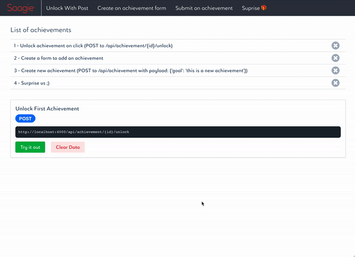

Achievement@App

   

Web Application to test Front End Skill on React.

## Saagievements (stands for Saagie achievements)

This project can be used as a base for frontend dev applicants interviews.

## Demo



## Development

**Funtional Assigments:**

:small_blue_diamond: Navigation throught the Achievements

:small_blue_diamond: Creation, and Reading of the Achievements

:small_blue_diamond:  Prpostition for The Saagie UI Design System

**Thecnical Assigments:**

:small_orange_diamond: Clean code

:small_orange_diamond: Styling

## Running Application 🖥️ (The asiest way 😊)

## Local Installation

1. clone repo

```
git clone https://github.com/olarra/saagieTest
```

3. cd into directory

```
cd saagieTest
```

3. install node dependencies using npm or yarn

```
yarn OR npm i
```

3. Run Client

```
yarn run start-react
```

4. Run Server

```
yarn run start-api
```

## Doubts? Ideas? Corrections?

Send an Issue, a pull request or knock me in my **<u>Live Chat</u>** at  https://jesus-garnica-olarra.herokuapp.com/